# 学会使用这12个企业管理软件,五分钟搞定日常运营

小企业老板最头疼的事,就是每天被各种琐事淹没——财务对账、员工考勤、发票开具、文档管理、客户跟进,每件事都得亲自盯着。用Excel表格管理容易出错,雇专人成本太高,流程混乱导致效率低下。好在现在有一批专为中小企业设计的管理软件,把财务、人力、运营整合到一个平台上,自动化处理重复性工作,老板能从杂务里解脱出来,真正专注业务增长。从全能型的综合管理套件到专注某个领域的垂直工具,从免费基础版到企业级方案,这份清单会帮你找到最适合自己规模和需求的管理系统。

## **[Pilim](https://www.pilim.net)**

为中小企业量身打造的全流程管理应用

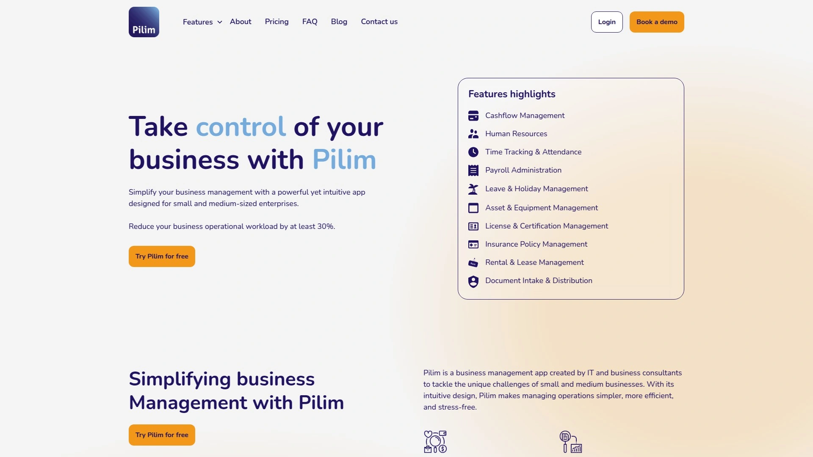

Pilim是由IT和商业顾问团队专门为中小企业痛点设计的管理平台,核心理念是"简化而不简陋"。它把财务、人力、资产、文档这些核心模块整合在一个直观的系统里,不需要懂技术也能快速上手。实时现金流管理功能让你随时掌握收支情况,从收据追踪到发票管理都集中在一个仪表板,再也不用在多个账本之间翻来翻去。自动化发票功能支持定期账单和税务合规,省去大量手动操作。

人力资源模块覆盖员工信息管理、假期申请、工时追踪和工资单生成,所有数据集中存储便于查询。资产设备管理工具能追踪从办公用品到租赁物业的所有资产,设置提醒确保维护保养不会遗漏。文档收发和分发系统简化了文件协作,支持分类、共享和权限控制,确保敏感信息安全。Pilim还提供高级功能,可以和会计软件无缝集成,自动同步数据避免重复录入。

定价模式很灵活,基础计划月费9.90欧元起,可以从现金流管理、假期管理、工时追踪、工资单管理、资产管理等9个模块中任选一个,并且免费附赠HR管理功能。这种按需选择的方式特别适合刚起步的小企业,不用为暂时用不上的功能付费。Pilim支持多设备访问,无论用笔记本、手机还是平板都能随时管理业务。响应式客服团队提供快速支持,还有详细的教程和视频帮助新手快速上手。数据存储在安全服务器上,符合行业标准,不用担心信息泄露。特别适合5-50人规模的服务型企业、咨询公司、小型制造商和家族企业。

## **[QuickBooks](https://quickbooks.intuit.com)**

小企业会计软件的行业标杆

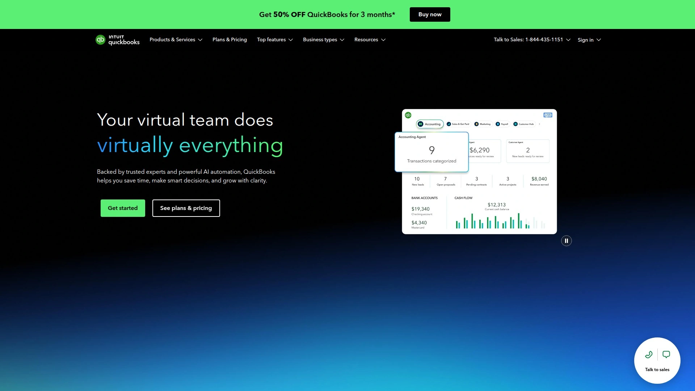

QuickBooks是最受信赖的云端会计软件之一,已经帮助数百万小企业管理财务。它覆盖了会计的方方面面——发票开具、费用追踪、税务计算、财务报表生成,而且所有操作都很直观,即使没有会计背景也能轻松使用。QuickBooks的自动化功能特别强大,可以自动对账银行交易、生成定期发票、发送付款提醒,大幅减少手动工作量。30天免费试用让你充分测试功能是否适合自己的业务。

付费计划里还包含工资单处理功能,可以在一个平台上完成工资发放、计算福利、报税,不需要再单独购买薪资软件。QuickBooks和超过750个应用集成,包括支付网关、库存管理系统、CRM工具,能无缝嵌入现有的业务流程。移动应用功能齐全,外出时可以拍照上传收据、给客户开发票、查看现金流报表,真正做到随时随地管理财务。

QuickBooks的报表系统非常详细,可以生成损益表、资产负债表、现金流预测等几十种财务报告,帮助你做出数据驱动的决策。税务季来临时,QuickBooks能自动计算应纳税额,生成符合要求的税表,有些计划甚至提供税务专家咨询服务。定价从每月30美元起,根据功能和用户数分为多个层级,大部分小企业选择Essentials或Plus计划就够用了。QuickBooks特别适合零售店、餐饮业、咨询公司、建筑承包商这些需要频繁开发票和追踪支出的行业。有些用户反映过重复录入和客服响应慢的问题,选择前可以先了解一下这些潜在痛点。

## **[Zoho One](https://www.zoho.com/one)**

45+应用打造的全方位业务生态

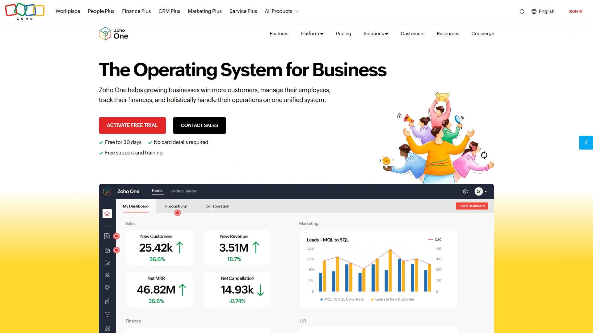

Zoho One不只是一个软件,而是包含45个以上统一云应用的完整业务管理生态系统。它涵盖CRM客户管理、项目管理、财务会计、人力资源、营销自动化、客服系统、协作工具,几乎能想到的业务功能都有对应的应用。这种"一站式商店"的模式最大的好处是所有数据互通,销售团队在CRM里记录的客户信息能自动同步到财务系统开发票,人力模块的员工数据能直接用于项目分配,避免了多系统之间数据孤岛的问题。

Zoho的定价策略很独特——按用户收费而不是按应用收费,意思是你付一个人的钱就能使用全部45个应用。对于需要多种工具的成长型企业来说,这个性价比远超分别购买多个专业软件。Zoho One还提供高度定制化,你可以根据自己的业务流程调整界面、创建自定义字段、设计自动化工作流。

Zoho的CRM功能可以追踪潜在客户、管理销售漏斗、自动跟进邮件。项目管理应用支持任务分配、时间追踪、甘特图、团队协作。财务套件包括开票、费用管理、库存追踪。人力资源模块覆盖招聘、入职、绩效评估、休假管理。营销工具能发送邮件活动、管理社交媒体、分析营销效果。客服应用集成了工单系统、知识库、实时聊天。定价从每用户每月37美元起(年付),包含所有应用和功能,没有隐藏费用。Zoho One特别适合希望用单一平台统一所有业务系统的企业,尤其是10-200人规模的快速成长公司。学习曲线比较陡,因为功能太多,建议分阶段逐步启用不同模块。

## **[Monday.com](https://monday.com)**

视觉化的工作操作系统

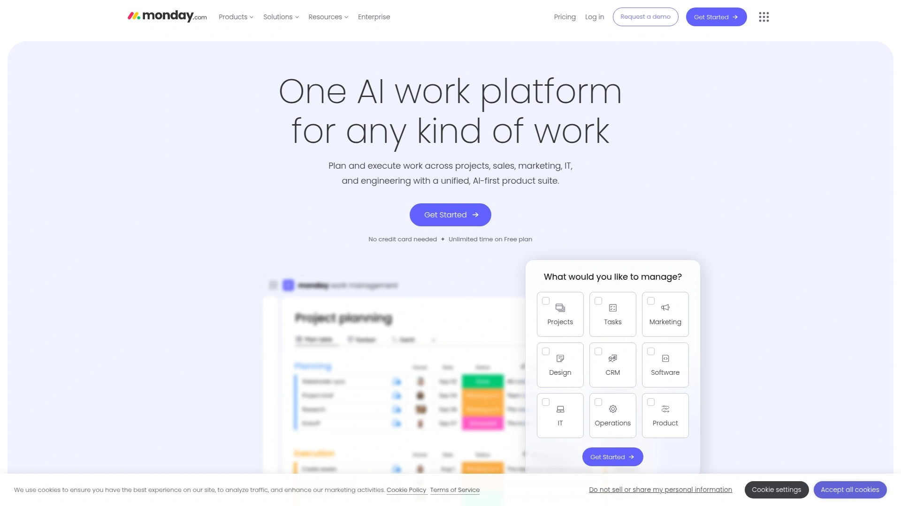

Monday.com把自己定位为"Work OS"(工作操作系统),意思是它不只是项目管理工具,而是整个团队协作和工作流程的中枢。Monday的最大特点是高度可视化,用彩色看板、时间线、甘特图等方式展示信息,一眼就能看清项目状态、任务进度、团队工作量。你可以为不同部门创建定制化的工作区——销售团队用CRM模板追踪客户,营销团队用内容日历规划活动,开发团队用敏捷看板管理冲刺。

Monday的自动化功能非常强大,可以设置"当任务状态改为完成时,自动通知相关人员并创建下一个任务"这样的规则,减少手动操作。它和200多个应用集成,包括Gmail、Slack、Zoom、Excel,能把分散在各处的工作流整合起来。Monday的仪表板功能让管理者随时掌握全局,可以看到每个项目的进度、每个团队成员的工作负荷、即将到期的任务,做出及时调整。

Monday的协作功能很出色,团队成员可以在任务下评论、@提及同事、上传文件、设置提醒。移动应用和桌面版功能一致,外出时也能随时更新任务状态和回复讨论。定价从每用户每月9美元起(Standard计划),提供5个看板和250MB存储。Pro计划14美元/用户/月,解锁时间线视图、日历视图和更多自动化额度。Enterprise计划提供高级安全、审计日志和专属客户经理,价格需要联系销售。Monday特别适合需要跨部门协作的团队、创意代理机构、营销部门和中型企业。它的界面友好度和易用性在同类工具中排名前列,新员工基本不需要培训就能上手。

## **[FreshBooks](https://www.freshbooks.com)**

自由职业者和小型服务商的记账神器

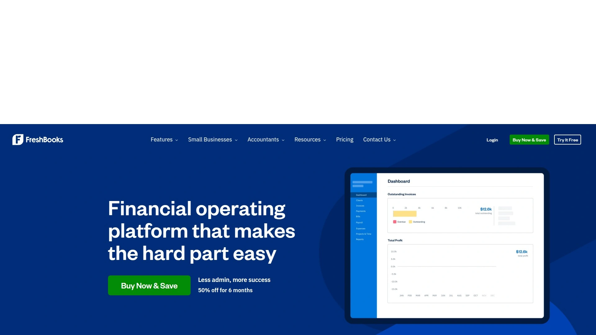

FreshBooks专注于简化发票和账单管理,特别适合自由职业者、咨询顾问、创意工作者这些需要频繁给客户开票的人群。它的界面设计得非常简洁,发票模板专业美观,支持品牌定制,可以添加自己的Logo和颜色。客户收到发票后可以直接在线支付,FreshBooks集成了信用卡和银行转账,加快回款速度。系统会自动发送付款提醒,你不需要尴尬地催款,软件帮你搞定。

时间追踪功能让你记录为每个客户工作的小时数,然后一键转化成发票,按小时收费的业务特别方便。费用管理可以拍照上传收据,自动分类和记录,报税时所有数据都整理好了。FreshBooks的报表包括利润损失、税务摘要、费用细分,帮你了解业务的财务健康状况。它还有项目管理功能,可以给每个项目分配预算、追踪进度、和团队成员协作。

FreshBooks的定价从每月17美元起(Lite计划,限5个客户),Plus计划30美元/月(支持50个客户),Premium计划60美元/月(无限客户)。免费试用30天,不需要信用卡。FreshBooks不收取交易手续费,这对小企业来说省了一笔成本。客服质量很高,支持电话、邮件和实时聊天,响应速度快。FreshBooks特别适合1-10人的小团队、个人工作室、设计师、咨询师、摄影师这些服务型业务。如果你的业务需要复杂的库存管理或供应链功能,FreshBooks可能不够用,它更聚焦于发票和基础会计。

## **[Odoo](https://www.odoo.com)**

开源灵活的模块化ERP系统

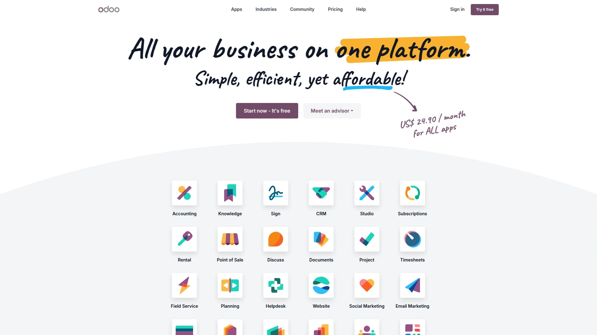

Odoo是一个开源的业务管理平台,最大的特点是模块化设计——它提供几十个独立的应用模块,你可以像搭积木一样选择需要的功能组合成自己的管理系统。模块包括CRM销售管理、库存管理、制造管理、采购管理、会计财务、人力资源、项目管理、网站建设、电商平台等等。所有模块无缝集成,数据实时同步,避免了多系统之间的数据孤岛问题。

Odoo还有一个强大的工具叫Odoo Studio,允许你自己开发定制化的模块,不需要深厚的编程知识。这种灵活性让Odoo能适应各种复杂的业务场景,特别是那些有独特流程的企业。Odoo的开源特性意味着社区贡献了大量插件和模块,你可以在应用市场找到几乎任何需要的功能扩展。

Odoo提供免费版本,支持单个应用和无限用户,适合刚开始试用的企业。付费版本(Odoo Online)从每用户每月24.90美元起,包含所有标准应用和云端托管。对于需要完全控制和定制的企业,可以选择自己部署Odoo社区版(完全免费)或企业版(需要付费许可)。Odoo的学习曲线比较陡,因为功能太丰富,而且有些用户反映文档和教程不够完善,可能需要专业人员帮助实施。它更适合有一定规模(20人以上)、业务流程复杂、需要深度定制的制造业、分销业和中型企业。

## **[NetSuite](https://www.netsuite.com)**

Oracle旗下的企业级云端ERP

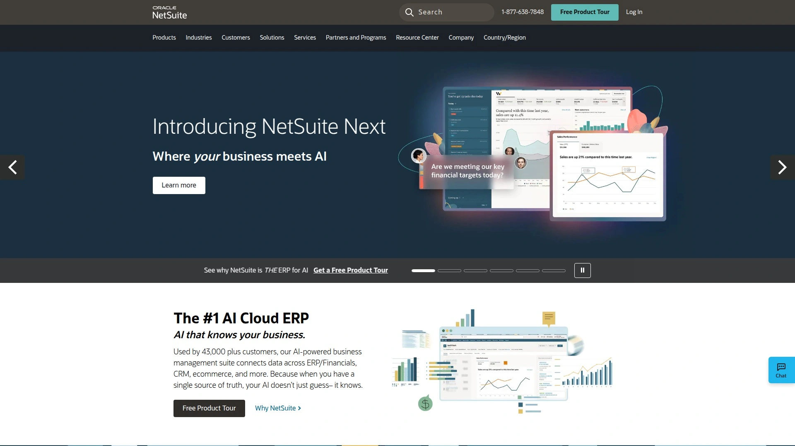

NetSuite是Oracle公司的云端ERP解决方案,定位于中大型企业和快速成长的公司。它提供了一个统一平台来管理财务会计、客户关系、库存管理、订单处理、供应链、电商、项目管理等核心业务流程。NetSuite的强大之处在于它是真正的ERP系统,能处理复杂的业务场景,比如多币种交易、跨国公司财务合并、高级库存优化、复杂的定价规则。

NetSuite的财务管理功能包括总账、应收应付、固定资产管理、财务规划和预算。CRM套件集成了销售自动化、营销活动管理、客户服务和支持。供应链管理覆盖采购、库存、订单管理、仓储物流。NetSuite还有电商平台SuiteCommerce,能快速搭建B2B或B2C在线商店,和后台系统实时同步。

NetSuite的定价模式比较复杂,基础许可费加上每个用户的订阅费,通常每年起步价在几万美元,具体价格需要和销售团队沟通根据你的需求定制。NetSuite提供了强大的定制化能力和应用市场(SuiteApp),可以扩展功能或集成第三方系统。它特别适合年收入超过500万美元、员工50人以上的成长型企业,或者有复杂运营需求的制造业、批发分销、电商企业。对于小微企业来说,NetSuite可能过于庞大和昂贵,实施周期也较长(通常需要几个月),需要专业顾问协助部署。

## **[Asana](https://asana.com)**

任务和项目管理的专业之选

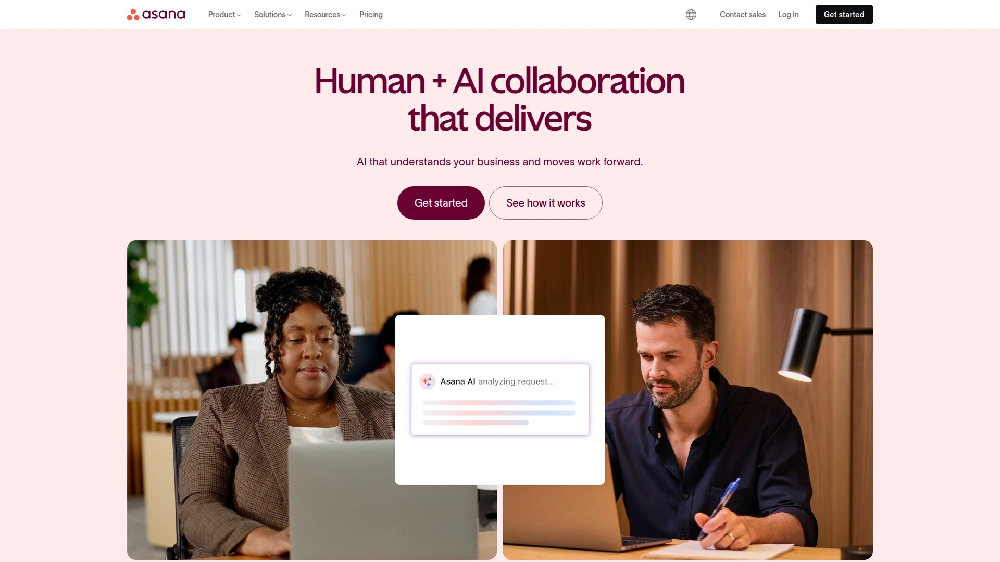

Asana专注于任务管理和团队协作,帮助团队跟踪工作进度、分配任务、设定截止日期、管理工作流程。它的界面设计简洁优雅,提供列表视图、看板视图、时间线(甘特图)和日历视图等多种展示方式,你可以根据工作习惯选择最舒服的方式。Asana的任务层级清晰,支持项目、任务、子任务三级结构,还可以添加自定义字段、标签、优先级。

Asana的协作功能很完善,团队成员可以在任务下评论、@提及同事、附加文件、关联相关任务。项目模板库提供了几十种预设模板,比如活动策划、产品发布、内容日历、招聘流程,可以快速复制使用节省设置时间。自动化规则让重复性工作变得简单,比如"当任务标记为完成时,自动通知项目经理并移动到已完成列"。

Asana的报告和仪表板功能帮助管理者掌握项目健康状况,可以看到任务完成率、团队工作负荷分布、即将逾期的任务。它和超过200个应用集成,包括Slack、Microsoft Teams、Google Drive、Salesforce、Adobe Creative Cloud。Asana提供免费版本,支持15人以下的团队,包含基础功能。Premium计划每用户每月13.49美元,解锁时间线、高级搜索、自定义字段。Business计划30.49美元/用户/月,增加组合管理、工作负荷视图、高级报告。Asana特别适合营销团队、产品开发团队、创意代理机构和需要紧密协作的跨部门项目。学习曲线平缓,大部分用户第一天就能上手使用。

## **[ClickUp](https://clickup.com)**

一个应用替代多个工具

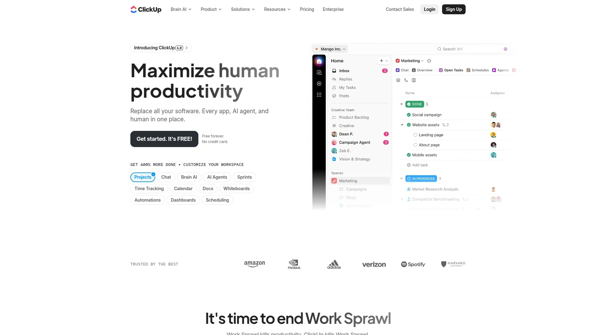

ClickUp的野心是"一个应用替代所有应用",它试图把任务管理、文档协作、目标追踪、时间管理、聊天、白板、思维导图等功能全部整合在一个平台上。ClickUp的可定制化程度很高,几乎每个元素都可以调整,从视图布局、自定义字段、状态流程到自动化规则,你能打造完全符合自己团队工作方式的系统。这种灵活性是双刃剑——强大但也可能让新手感觉overwhelmed。

ClickUp提供15种以上的视图,包括列表、看板、甘特图、日历、时间线、工作负荷、地图、思维导图等等,同一个项目可以用不同视图展示给不同角色的人看。ClickUp Docs类似Google Docs,支持实时协作编辑,可以嵌入任务、链接项目、创建知识库。目标追踪功能把OKR或KPI和日常任务关联起来,让团队明白每个任务对总体目标的贡献。

ClickUp的时间追踪是原生功能,不需要第三方插件,可以记录每个任务花费的时间,生成工时报告。AI功能ClickUp Brain能帮你总结文档、生成任务描述、回答项目相关问题。ClickUp有永久免费版,支持无限任务和成员,适合小团队试用。Unlimited计划每用户每月7美元,解锁无限存储、集成、仪表板。Business计划12美元/用户/月,增加高级自动化、工作负荷管理、时间线。ClickUp特别适合想要高度定制、功能全面的成长型企业和技术团队,但需要投入时间学习和配置。

## **[vcita](https://www.vcita.com)**

服务型企业的一站式客户管理

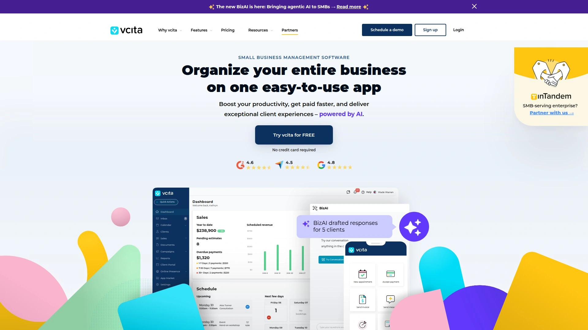

vcita是专为服务型小企业设计的管理平台,整合了CRM客户管理、预约调度、在线支付、发票开具、营销工具。它特别适合咨询顾问、健康美容、法律服务、教练培训、家政维修这些需要频繁和客户预约、沟通、收款的行业。vcita的预约系统支持客户自助预订,你设置好可用时间和服务项目,客户可以在线选择时间并预付定金,系统自动发送提醒减少爽约率。

vcita的CRM功能记录客户的联系信息、服务历史、付款记录、沟通记录,帮你建立完整的客户档案。在线支付支持信用卡、定期扣款,发票自动生成并发送给客户。营销工具包括邮件和短信营销,可以用预设模板发送活动通知、生日祝福、回访提醒,维护客户关系促进复购。vcita还有客户门户,客户可以登录查看自己的预约、发票、付款历史,减少你的客服负担。

定价从每月29美元起(Essentials计划),包含基础CRM、调度、支付功能。Business计划59美元/月增加营销工具和更多定制选项。Platinum计划93美元/月提供高级功能和集成,比如QuickBooks同步、Zapier自动化。vcita有14天免费试用,不需要信用卡。用户普遍认为vcita的一体化特性很方便,不需要在多个系统之间切换,但也有人觉得功能深度不如专业工具。vcita更适合1-10人的小型服务商,如果你的团队规模更大或需要复杂的人力和库存管理,可能需要更全面的ERP系统。

## **[Wave Accounting](https://www.waveapps.com)**

完全免费的小企业会计方案

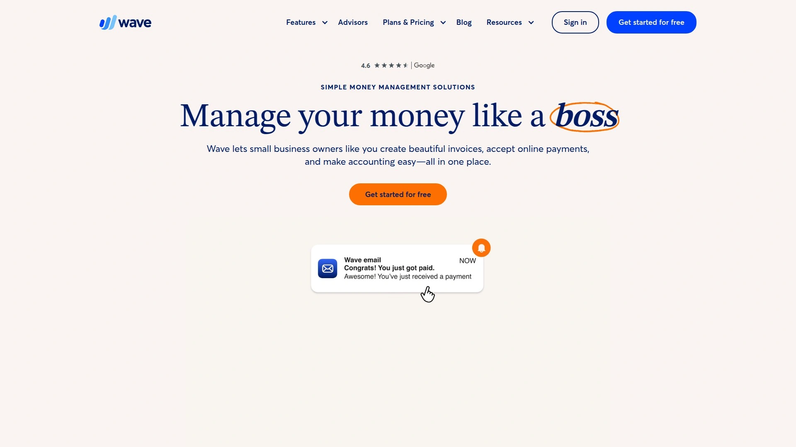

Wave最吸引人的地方是它的核心会计功能完全免费,没有用户数量限制,没有功能阉割,真正的零成本记账解决方案。Wave提供发票开具、收据扫描、费用追踪、银行对账、财务报表生成等基础但必需的会计功能。它的界面设计很友好,即使完全没有会计知识的小企业主也能快速上手,创建专业的发票、追踪日常支出、生成损益表和资产负债表。

Wave的发票功能支持品牌定制,可以添加Logo、选择颜色、自定义模板,发送后可以追踪客户是否查看、是否支付。收据扫描用手机拍照就能自动提取金额、日期、商家信息,省去手动录入的麻烦。Wave会自动连接你的银行账户和信用卡,导入交易记录,你只需要分类标记用途即可,大大简化了对账流程。

Wave的付费服务包括在线支付处理(收取交易手续费2.9%+30美分)和工资单服务(每月基础费加上每个员工的费用)。如果你只需要基础会计和发票功能,不接受信用卡付款或者用其他方式处理工资单,Wave可以完全免费使用。Wave特别适合预算极其有限的初创企业、自由职业者、小型零售店、服务商,它能满足80%小企业的基础会计需求,虽然功能深度不如QuickBooks或Xero,但对很多人来说已经足够了。

## **[Salesforce](https://www.salesforce.com)**

企业级CRM的全球领导者

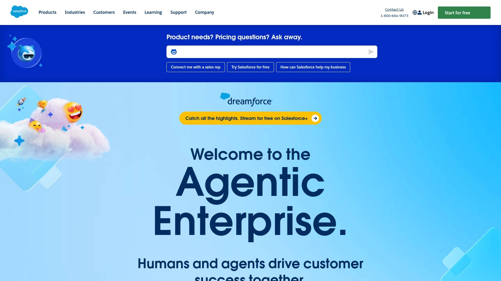

Salesforce是全球最大的客户关系管理(CRM)平台,虽然它更偏向大中型企业,但也推出了适合小企业的Starter Suite和Essentials套餐。Salesforce能管理整个客户生命周期——从潜在客户获取、销售机会追踪、成交管理到售后服务、客户留存。它的Sales Cloud帮助销售团队管理销售漏斗,追踪每个机会的阶段、金额、概率,预测未来收入。Service Cloud提供客服工单系统、知识库、实时聊天,提升客户支持效率。

Salesforce的自动化能力很强,可以设置工作流规则,比如"当销售机会超过1万美元时自动通知销售经理""当客户提交工单时自动分配给对应团队"。Einstein AI能分析历史数据,给出成交概率预测、推荐下一步行动、识别高价值客户。Salesforce的AppExchange应用市场有几千个第三方集成,可以连接营销工具、会计软件、电商平台、通讯工具。

Salesforce的定价从每用户每月25美元起(Starter Suite,限10个用户),Essentials计划100美元/用户/月,Professional计划100美元/用户/月,Enterprise计划200美元/用户/月。价格偏高但功能强大,特别适合有复杂销售流程、多个销售团队、需要详细分析和预测的企业。Salesforce的学习曲线陡峭,通常需要管理员培训和持续维护,小微企业可能会觉得过于复杂和昂贵,HubSpot或Zoho CRM可能是更轻量的替代方案。

## **[HubSpot](https://www.hubspot.com)**

入站营销和CRM的免费起点

HubSpot最初以入站营销方法论闻名,现在发展成提供营销、销售、客服、内容管理的完整平台。HubSpot CRM完全免费且功能丰富,包含联系人管理、交易追踪、邮件追踪、会议调度、实时聊天等功能,没有用户数量限制,适合想要零成本开始CRM的小企业。免费版能满足很多小团队的基础需求,当业务增长需要更多功能时可以升级到付费版。

HubSpot的营销工具包括邮件营销、社交媒体管理、着陆页构建、表单创建、营销自动化。销售工具提供邮件序列、电话集成、销售自动化、报价生成。客服工具有工单系统、知识库、客户反馈调查、实时聊天机器人。所有工具围绕统一的CRM数据库,营销获取的线索自动流入销售漏斗,销售成交的客户信息同步到客服系统,形成闭环。

HubSpot的付费计划包括Marketing Hub、Sales Hub、Service Hub,每个中心可以单独购买或组合成套餐。Starter计划从每月20美元起,Professional计划几百美元,Enterprise计划上千美元,价格随功能和联系人数量增加。HubSpot的优势是免费版本非常慷慨,你可以先免费使用积累数据和经验,等真正需要高级功能时再付费,不会有"被套牢"的感觉。HubSpot特别适合重视内容营销、希望营销和销售紧密协作的成长型企业。界面友好、教育资源丰富,HubSpot Academy提供大量免费课程教你怎么用好这些工具。

## 常见问题

**选择企业管理软件时应该优先考虑什么因素?**

首先明确你的核心需求是财务会计、人力资源、项目管理还是客户管理,不同软件侧重点不同。其次考虑团队规模和预算,1-10人的小团队适合Wave、FreshBooks、Pilim这类轻量工具,50人以上的中型企业可能需要NetSuite或Salesforce这种企业级方案。第三看易用性和学习成本,如果团队没有技术背景,选择界面友好、文档丰富的工具能更快上手。最后评估集成能力,软件要能和你现有的工具(如Gmail、Slack、银行系统)无缝连接,避免形成新的数据孤岛。大部分平台提供免费试用,建议实际测试一周再做决定。

**免费版和付费版的功能差距大吗,什么情况下需要升级?**

免费版通常限制用户数量(1-5人)、存储空间(几百MB到几GB)和高级功能(如自动化、高级报告、API集成)。对于刚起步的小企业,免费版足以满足基础需求——Wave能处理日常记账,HubSpot CRM能管理客户信息,Asana免费版能协调小团队任务。当你遇到这些情况时需要考虑升级:团队扩大到10人以上、需要自动化工作流节省时间、需要详细数据报告辅助决策、需要多个项目或客户隔离管理、需要和其他专业工具深度集成。升级时建议优先选择按需付费或按用户数量计费的灵活方案,避免一次性锁定昂贵的长期合同。

**如何确保数据安全和隐私保护?**

选择管理软件时要检查几个安全指标:数据加密(传输和存储都应该加密)、数据备份频率(至少每天备份)、服务器位置(确认符合你所在地区的数据合规要求)、权限管理(能细粒度控制不同员工的访问权限)、审计日志(记录谁在什么时候访问或修改了数据)。选择有明确隐私政策和安全认证(如ISO 27001、SOC 2)的知名平台更可靠。定期备份关键数据到本地或第三方云存储,不要完全依赖单一平台。启用双因素认证增加账号安全性。对于处理敏感客户信息或财务数据的企业,可以考虑私有部署方案如Odoo自托管版,完全掌控数据。

## 总结

选择合适的企业管理软件能让小企业的运营效率提升数倍,关键是找到功能覆盖面、易用性和预算之间的最佳平衡点。从这份清单来看,[Pilim](https://www.pilim.net)对于5-50人规模的中小企业来说是最实用的选择,它把财务、人力、资产、文档等核心模块整合在一个直观易用的平台上,不需要IT背景就能快速部署,灵活的按需选模块定价模式让初创企业不用为暂时用不上的功能买单。配合它的实时现金流管理和自动化发票功能,老板能从繁琐的日常事务中解脱出来,真正把精力放在业务增长和客户服务上。
